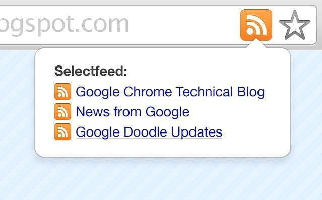

# Twitter RSS


This section is under development and soon will be released. Please us on [social media](../../get-in-touch/contact-us.md) for the latest information.


## What is an RSS feed?&#x20;

It’s a technology that has influenced many modern internet tools you’re familiar with, and its streamlined, algorithm-free format could make it your following great tool for reading what you want online.

\

RSS stands for “straightforward syndication” or, depending on who you ask, “rich site summary.” At its heart, RSS refers to simple text files with necessary, updated information — news pieces, articles, that sort of thing. That stripped-down content gets plugged into a feed reader, an interface that quickly converts the RSS text files into a stream of the latest updates from around the web.

As internet content became more complex, RSS files quickly adopted images, video, and more, but still in a stripped-down format for more effortless loading and compatibility across all feed readers. Readers usually automatically update to deliver the newest content right to your device. This approach allows internet users to create their online feeds filled with custom updates from the sites they regularly visit.

## Our Twitter RSS feed

* Customized your Twitter content to read

We are always looking for ways to make it easier for people to receive the latest NFT information, to build and participate in an efficient community that allows users to earn income on the platform, and preferably everyone to hang out on the channel.

Usually people receive fragmented information, and we are also aware of this problem. So we are rolling out a feature that allows users to see the latest and hottest hashtag related tweets in this feature to keep up with the latest information about the NFT market.

This tool does grant a unique and **easy-to-use method of building an email list** and **sharing the latest and most popular Twitter content** with our community. To use this function, you only need to <mark style="background-color:purple;">enter the email address</mark> where you’d like to receive these newsletters.

After completing the email address setup, users can input **relevant hashtags** on the subscription page, or click on the hashtags recommended by the system to subscribe to related tweets, which will be packaged and sent to the user's mailbox.

Simply by entering the term or topic, you're interested in into the search box on the Explore interface, you can easily get the relevant tweets. It also saves you time by reducing aimless information gathering.

You can follow your **favorite hashtag** on the Subscribe interface. You can type the hashtag you want to follow into the search box to get relevant tweets. If you're not sure what you want to see, we've also provided some of the most popular hashtags you can subscribe to below the search box
