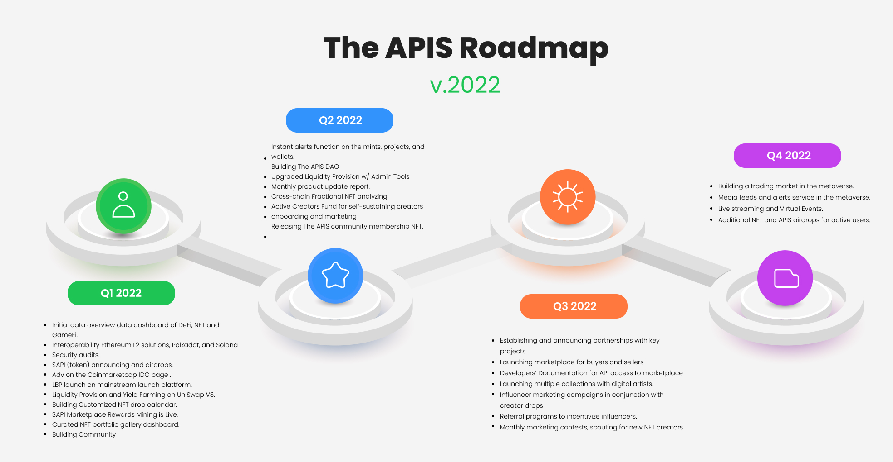

# 🤖 Roadmap

| Date    | Objectives                                                                 | Status        |
| ------- | -------------------------------------------------------------------------- | ------------- |
| Q4 2021 | Launch New Website                                                         | ~~Completed~~ |
|         | Complete The APIS - Dashboard                                              | ~~Completed~~ |
| Q1 2022 | Metamask Login                                                             | ~~Completed~~ |
|         | Improve Web UI                                                             | ~~Completed~~ |
|         | Finish Balancer LBP                                                        | ~~Completed~~ |
|         | Dashboard for NFT Assets                                                   | ~~Completed~~ |
|         | Integrate with Twitter                                                     | ~~Completed~~ |
|         | Integrate to Snapshot (DAO)                                                | Coming Soon   |
|         | Tool for Mint NFT                                                          | Coming Soon   |
|         | Launch Community Forum                                                     | Coming Soon   |
|         | NFT Calendar                                                               | ~~Completed~~ |
|         | NFT Favorites                                                              | Coming Soon   |
|         | Integrate with ENS                                                         | Coming Soon   |
| Q2 2022 | Noob Games Dashboard                                                       | Coming Soon   |
|         | Customized API service                                                     | Coming Soon   |
|         | Node Service                                                               | Coming Soon   |
|         | Building The APIS DAO                                                      | Coming Soon   |
|         | Instant alerts function on the mints, projects, and wallets                | Coming Soon   |
|         | Upgraded Liquidity Provision w/ Admin Tools                                | Coming Soon   |
|         | Monthly product update report                                              | Coming Soon   |
|         | Cross-chain Fractional NFT analyzing                                       | Coming Soon   |
|         | Active Creators Fund for self-sustaining creators onboarding and marketing | Coming Soon   |
|         | Releasing The APIS community membership NFT                                | Coming Soon   |
| Q3 2022 | Update Muti-Chain Query Service                                            | Coming Soon   |
|         | Deploy Public Chain                                                        | Coming Soon   |
|         | Establishing and announcing partnerships with key projects                 | Coming Soon   |
|         | Launching marketplace for buyers and sellers                               | Coming Soon   |
|         | Developers’ Documentation for API access to marketplace                    | Coming Soon   |
|         | Launching multiple collections with digital artists                        | Coming Soon   |
|         | Influencer marketing campaigns in conjunction with creator drops           | Coming Soon   |
|         | Referral programs to incentivize influencers                               | Coming Soon   |
|         | Monthly marketing contests, scouting for new NFT creators                  | Coming Soon   |
| Q4 2022 | Building a trading market in the Metaverse                                 | Coming Soon   |
|         | Media feeds and alerts service in the Metaverse                            | Coming Soon   |
|         | Live streaming and Virtual Events                                          | Coming Soon   |
|         | Additional NFT and APIS airdrops for active users                          | Coming Soon   |
|         | Establishing multichain public data analysis development stack             | Coming Soon   |
|         | Turning into community-driven comprehensive DAO organized ecosystem        | Coming Soon   |
