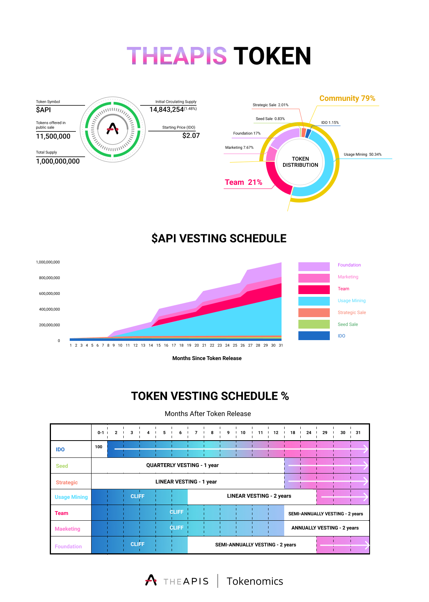

# Token Distribution

The APIS Protocol launched its mainnet on January 2022. We already finished our [Liquidity Bootstrapping Pool](https://theapisxyz.medium.com/instructions-for-participating-in-the-balancer-liquidity-bootstrapping-pool-blbp-for-the-apis-d83141b53f2c) (LBP), and so would like to re-post the API’s current distribution, as transparent token distributions are crucial for long-term incentive alignment and value creation in Web3.

**Our token economy:** We conducted a token split, adjusting the total supply of API from 100mn to **1bn**. There will be 1 billion API Tokens released unless the community votes to inflate the supply via additional incentivization programs or deflate the supply via token burn programs.&#x20;

79% of the token supply is allocated toward the community, with 50.34% to the users of the network via a usage mining program, 17% to API Foundation (established for strategic partnerships, namely prominent Web 2.0 or Web 3.0 applications).&#x20;

The remaining 21% is allocated for the founding and future team.


_Reference:_&#x20;

[Token Release schedule to Exchanges](https://docs.google.com/spreadsheets/d/1WDQD8aU4N9zr9gmDK8jmhUuGV2L0dUY1gWiOIuSTESI/edit#gid=1525456078)



