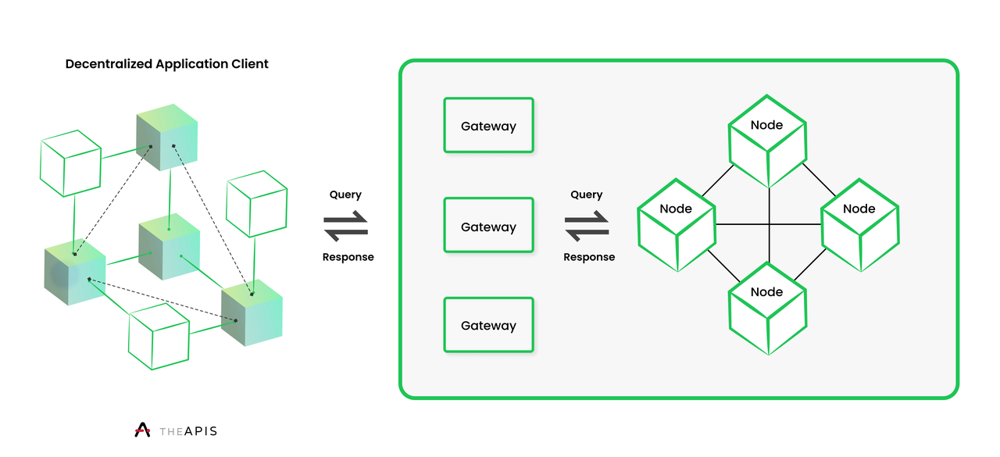

# 2.1 Message Propagation Protocol

The APIS Network is composed of two actors, both of which are open and configurable by any party: APIS Gateways and APIS Nodes. Queries requested by decentralized applications and their developers are responded to by APIS Gateways, while APIS Nodes index and manage databases pertaining to one or a group of smart contracts, such that APIS Nodes can respond to APIS Gateway requests with an average response time of 400ms (ϵ(t) < 400ms), under the condition that the requested endpoint from the APIS Gateway is already maintained by an APIS Node.

**Communication** between Gateways and Nodes is maintained through a brokerless, libp2p publish-subscribe messaging protocol, wherein Nodes subscribe to messages from a Gateway, which they can receive directly from the Gateway or from additional Nodes who also have also subscribed to that Gateway’s messaging propagation, although Nodes should assume counterparty Nodes are adversarial at all times, per any well-designed crypto-economic system.

**Gateways** maintain a registry of the subscribing Nodes from which they request endpoints based on the \<ID> of the endpoint, as Nodes will only index a select group of IDs. IDs are representational hashes of the datasets supported by the Network; only the hash of the ID is maintained on-chain in the Node and Gateway State Tries, described further in _2.6 Optimistic Rollup Contract_. It is up to each Gateway to determine how to filter messages from Nodes for each endpoint response, although we recommend a first-in, first-out approach, wherein subsequent messages, should they differ from the first sent message, can provide the Gateway with evidence warranting of initiating a challenge, described further in _2.5 Dispute Resolution Contract Factory_.
