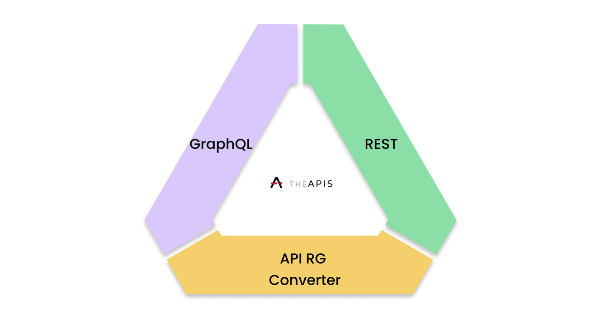

# 2.2 Message Formatting Overview

Queries are sent by client-side applications directly to Gateways and returned by Gateways in industry standard GraphQL and REST formatting, thus allowing for the adoption of APIS by a global developer pool and consequently expanding the developer market of public blockchains. GraphQL and RESTful differentiate themselves in how they manage and return queries: GraphQL provides a single endpoint for the requested data, while REST provides multiple endpoints, which renders REST less efficient but also more customizable. REST has achieved more significant mainstream adoption than GraphQL due to its first-mover advantage and consequent well-known integrations; however, GraphQL can tailor its query responses to exactly what the query is requesting, thus ensuring that there is no overfetching of data and that the application only receives the data that it needs with one, unilateral mode of communication. We believe that GraphQL will ultimately overtake REST, but to encourage adoption by as many engineers as possible, APIS Gateways will support both API formats for the foreseeable future.

To maintain optimal communication between APIS Nodes and Gateways, APIS Nodes will only support RESTful requests at launch, as RESTful requests can be packaged by APIS Gateways into GraphQL format, through the APIS RG Converter, a proprietary but open-sourced technology that builds on the well-known stitching \[15] and prefixing \[16] techniques implemented in past conversation schemes. Thus, Gateways allows for the APIS network to support both types of queries by clients, while mitigating the operational intensity required to run an APIS Node. The APIS RG Converter can transform RESTful endpoint into a GraphQL endpoint (and vice-versa) in under 100ms (ϵ < 100ms), with an approximate success time of 95ms.

95ms, when added to the 400ms roundtrip estimation of message communication, renders a query to be returned in 500ms or less (ϵ < 500ms). The performance of the network will scale as the network scales, as Gateways and Nodes alike will compete with return queries under the fastest possible conditions, such as to win third-party client developer business. This is a long-term economic benefit of a protocol over a centralized aggregator, who can afford to innovate at a slower rate due to monopolistic market practices. However, in the interim, it is estimated that sub-500ms return times are adequate for decentralized finance and web user experiences.
