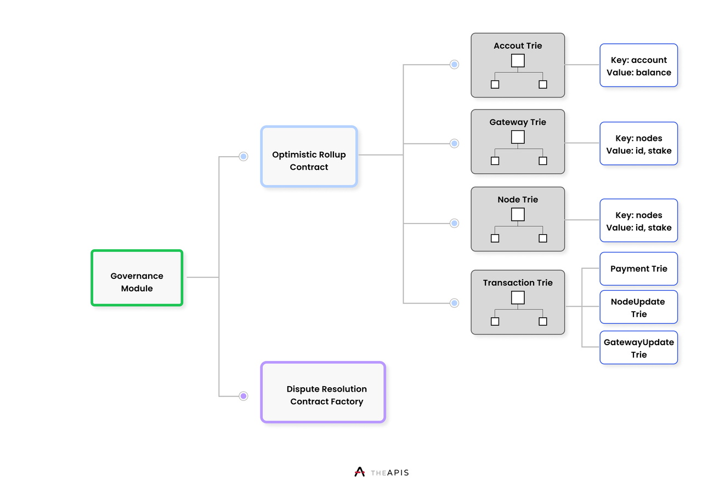

# 2.3 APIS Core Contracts

The APIS Gateways and Nodes act under rational economic incentives, enlisting their services for fees in an environment assumed to be perpetually adversarial. The state of the APIS Network is maintained by the APIS smart contract and layer-two rollup architecture, deployed on the Ethereum public blockchain.

The three primary contracts deployed on the Ethereum public blockchain are the governance contract, the dispute resolution factory contract, and the optimistic rollup contract. The governance contract allows for the configuration and upgrade of the rest of the architecture; the dispute resolution contract factory ensures that APIS Gateways and Nodes are incentivizes to only complete accurate responses; the optimistic rollup contract allows the architecture to scale significantly beyond the throughput of the current Ethereum public blockchain. Throughout the entire design, the concept of superfluidity is emphasized with regards to the API token, such that the holder of the token can participate in governance, dispute resolution, and optimistic rollup validation simultaneously, maximizing the potential revenue generation to API token holders.

